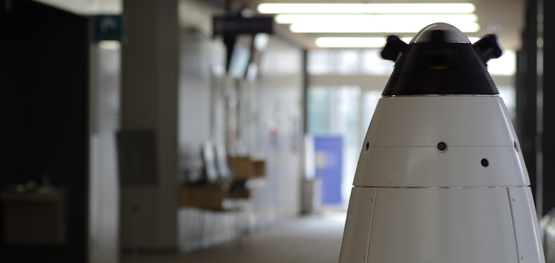
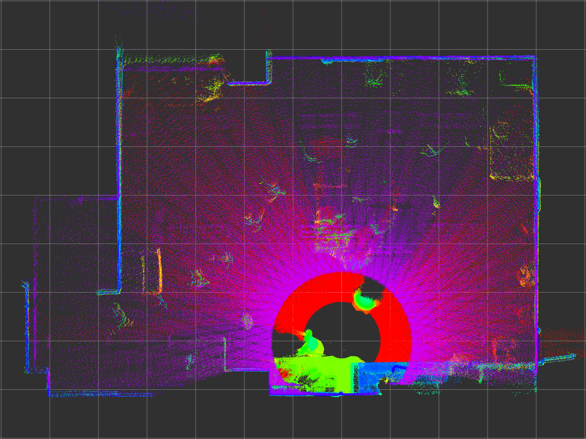
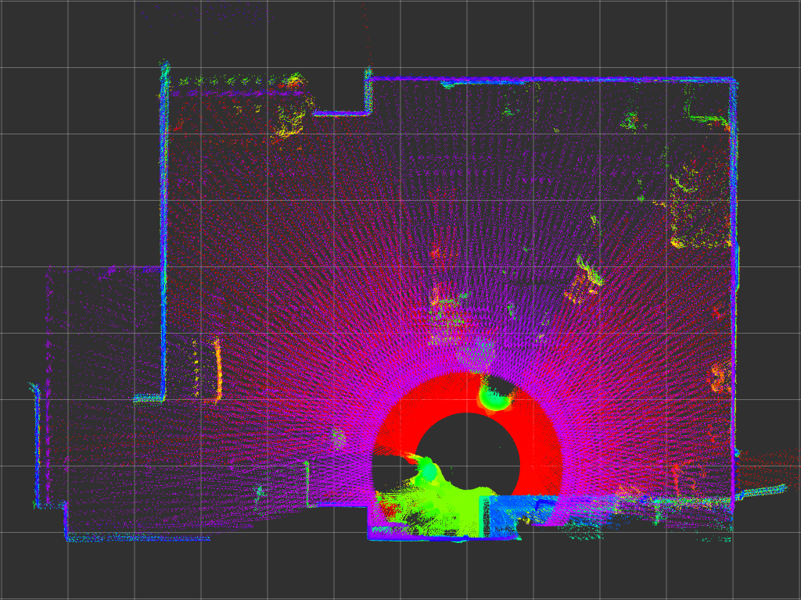
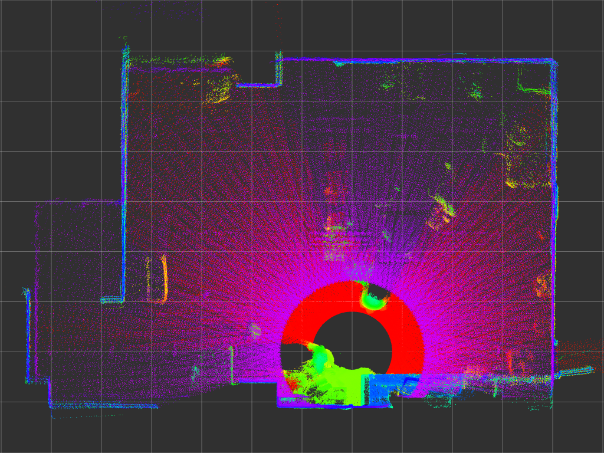
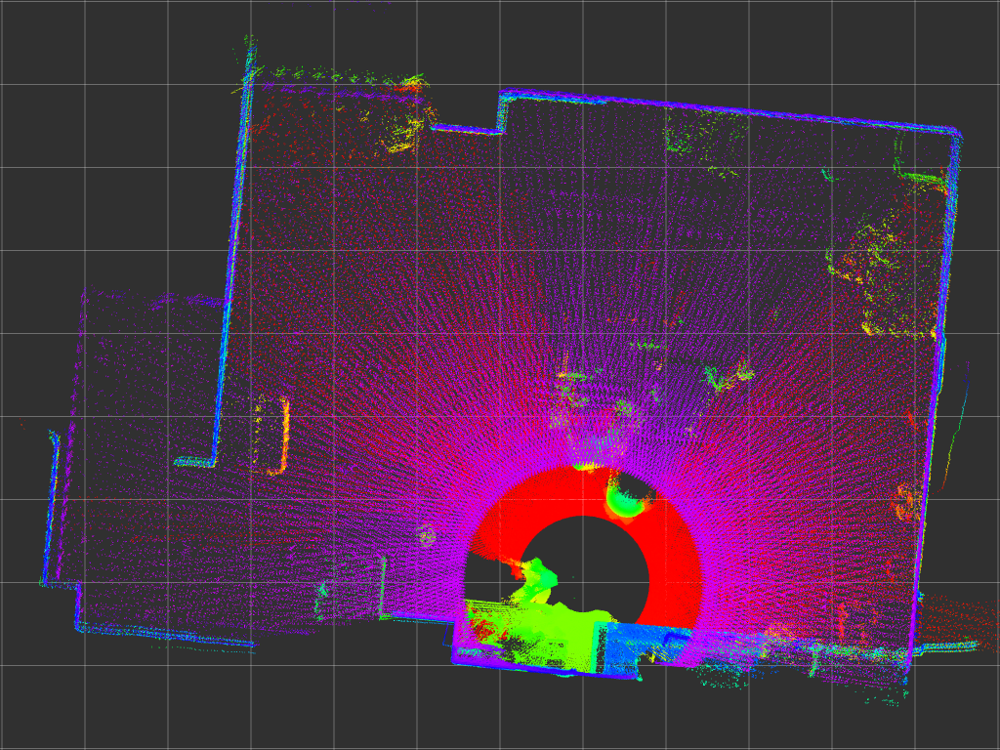
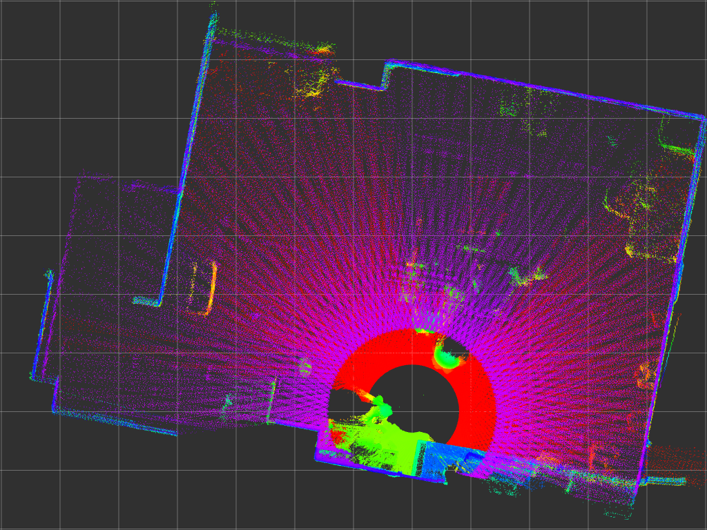
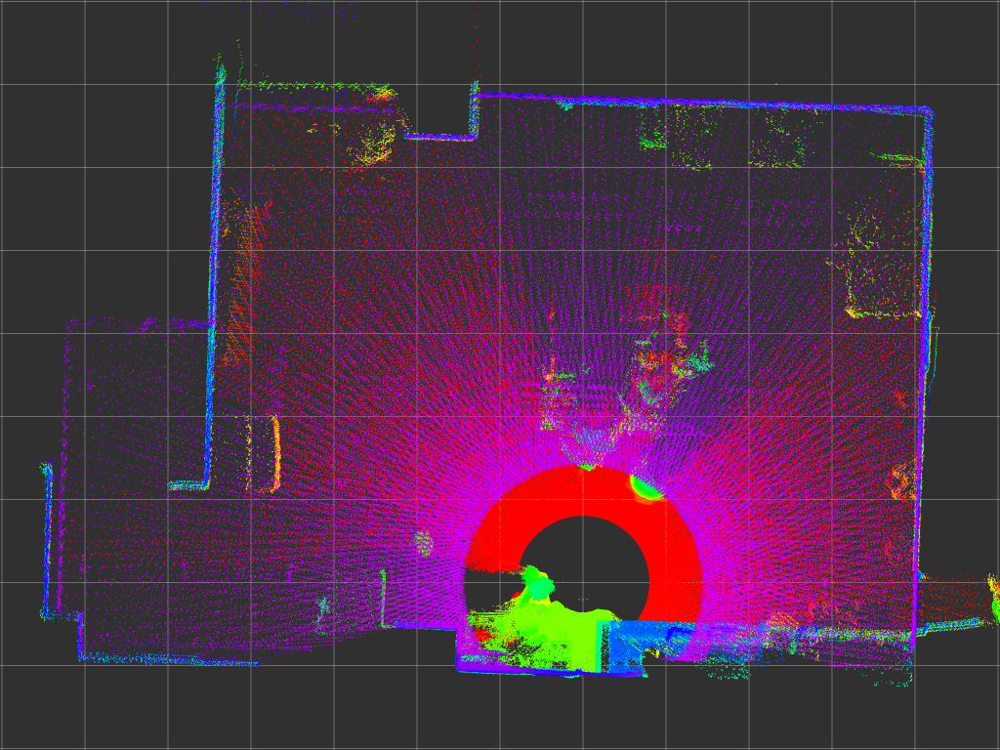

urg\_stamped
====================

Precisely and accurately stamped URG driver for ROS

## Background and Algorithm

2D-LIDAR URG series provides 1ms resolution timestamp and exclusive clock synchronization mode.
It was hard to compensate clock drift during measurement using them.
Also, the resolution of the timestamp was not enough for a high-speed motion of the sensor.

So, urg\_stamped estimates sub-millisecond by the following algorithm:

- Determine sensor internal clock state (clock offset and gain) using TM command
  - 1. Observe sub-millisecond clock offset by finding increment of millisecond resolution sensor timestamp
  - 2. Observe clock gain from multiple observations of the clock offset
- Determine scan origin time and interval
  - UTM: (UTM sends scan data right after the scan is finished)
    - 1. Observe scan timing based on scan data arrival time
  - UST: (UST sends scan data on the next 1ms frame after the scan is finished)
    - 1. Find sensor scan timestamp jitter
    - 2. Observe scan origin time and scan interval using scan timestamp jitter
- Calculate sub-millisecond scan timestamp based on the observed scan origin time and scan interval

## Usages

Topics and major parameters are designed to be compatible with [urg\_node](http://wiki.ros.org/urg_node).

### Published Topics

- **scan** (`sensor_msgs::LaserScan`)

### Parameters

#### urg\_node compatible parameters

- **ip_address** (string): device IP address
- **ip_port** (int): device TCP/IP port
- **frame_id** (string): frame\_id of published scans
- **publish_intensity** (bool): fill intensity field if true
- **error_limit** (int): reset the sensor and exit if errors occur more than this count

#### urg\_stamped specific parameters

- **clock_estim_interval** (double): sensor internal clock state estimation interval in seconds (dropping several scans during estimation)
- **fallback_on_continuous_scan_drop** (int): fallback to naive 1ms accuracy timestamp if failed to estimate sub-millisecond timestamp more than this value

## Known Limitations

- Timestamp estimation is designed for sensors connected by ethernet interface.
  - Tested only for UTM-30LX-EW and UST-20LX at now.
- Some scans are dropped due to the clock synchronization and delay estimation.

## Comparison with urg\_node

### Configurations

Three UTM-30LX-EWs are mounted on a velocity controlled turntable, as shown below, to reconstruct 3-D point cloud from 2-D scans.
The accuracy of the timestamp affects offset and precision of the timestamp affects the distribution of the pointcloud.

### Results

> [!NOTE]  
> Following results are based on the previous algorithm (urg\_stamped<0.2.0).
> They will be updated later.

The image below shows point cloud with 1 rad/s of the turntable which can be assumed as a reference.
(decay time of the point cloud: 10 seconds)

urg\_node has large error even if calibrate\_time and synchronize\_time options are enabled (captioned as `urg_node (sync)`).
urg\_stamped has better timestamp characteristics comparing with urg\_node.

&nbsp;              | 10 rad/s                                                         | 20 rad/s
---                 | ---                                                              | ---
urg\_stamped        |      | 
urg\_node           |            | 
urg\_node (sync) |  | 
